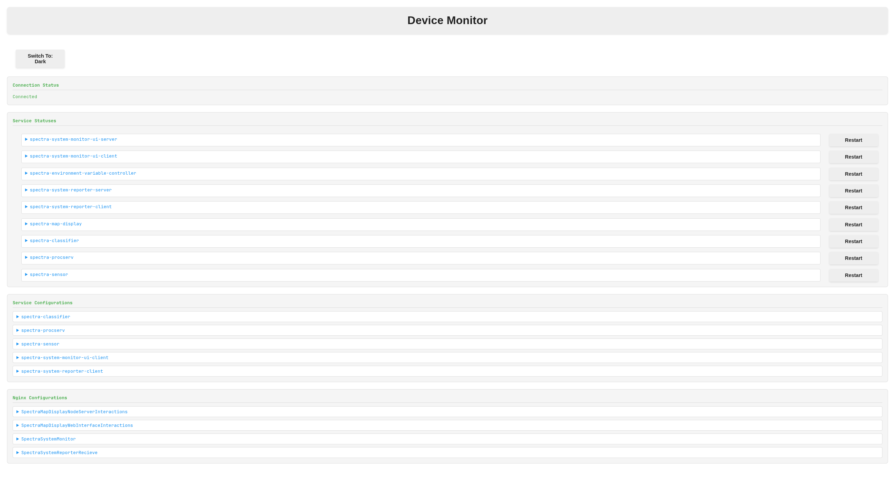
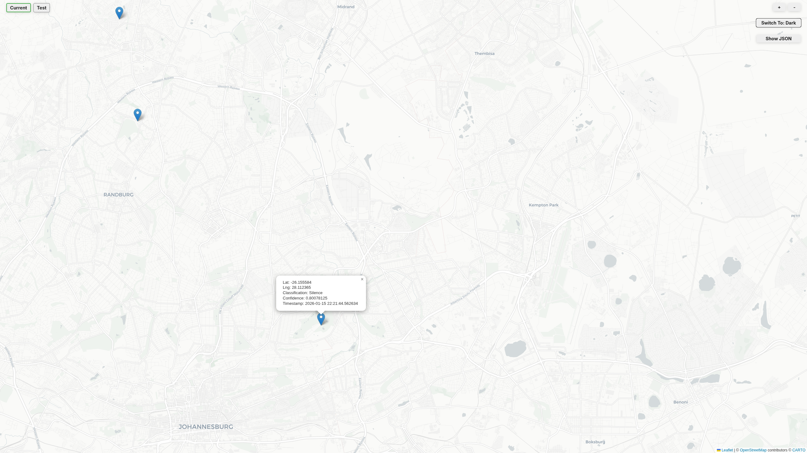
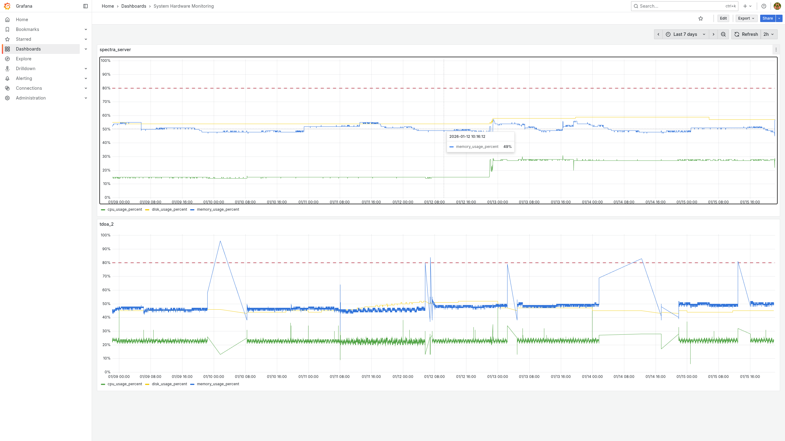

# Spectra

A distributed network of acoustic sensors designed to push the boundaries of my technical skills. It comprises software components that can run on a single machine or be distributed across multiple pieces of hardware. The components include:
- A C++ sensor for capturing and streaming audio and GPS data
- A C++ processing server for processing and storing data
- A Python audio classifier
- A Python database application for storing audio classifications and device reports
- A React-based device monitor for inspecting edge devices
- A React-based map display for monitoring live audio detections across the network
- A central Grafana dashboard to monitor the entire network

## Device Monitor

## Map Display

## System Monitor

# Getting Started

If you would like to set up this network, feel free to get in touch. Depending on availability, I can provide images and artifacts to help you get started.